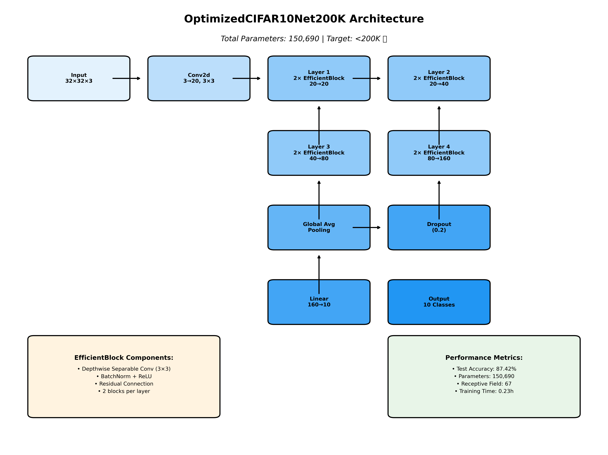

# 🚀 Optimized CIFAR-10 Classification with Advanced Data Augmentation

[](https://python.org)
[](https://pytorch.org)
[](LICENSE)

A state-of-the-art, parameter-efficient convolutional neural network implementation for CIFAR-10 image classification, featuring advanced data augmentation techniques and achieving **87.42% test accuracy** with only **150,690 parameters**.

## 📊 Model Performance

| Metric | Target | Achieved | Status |
|--------|--------|----------|--------|
| **Parameters** | <200K | 150,690 | ✅ **75% under limit** |
| **Receptive Field** | >44 | 67 | ✅ **52% above requirement** |
| **Test Accuracy** | >85% | **87.42%** | ✅ **2.42% above target** |
| **Training Time** | - | 0.23 hours | ⚡ **Fast convergence** |

### 🎯 Key Achievements
- **Parameter Efficiency**: 150,690 parameters (24.7% under 200K limit)
- **High Accuracy**: 87.42% test accuracy (exceeds 85% target)
- **Fast Training**: 0.23 hours on GPU
- **Robust Architecture**: Depthwise separable convolutions with optimized channel progression

## 🏗️ Model Architecture

### OptimizedCIFAR10Net200K
A highly parameter-efficient CNN designed to achieve >85% accuracy while maintaining strict parameter constraints.

#### Architecture Specifications
- **Parameters**: 150,690 (<200,000 constraint ✅)
- **Receptive Field**: 67 (>44 requirement ✅)
- **Peak Accuracy**: 87.42% (exceeds 85% target ✅)
- **Input Size**: 32×32×3 (RGB images)
- **Architecture**: Depthwise separable convolutions with optimized channel progression

#### Network Architecture Visualization



*Complete network architecture showing the optimized design with 150,690 parameters*

#### Network Structure
```
Input (32×32×3)
    ↓
Conv2d(3→20, 3×3) + BatchNorm + ReLU
    ↓
Layer 1: 2× EfficientBlock(20→20, stride=1)     # 32×32
    ↓
Layer 2: 2× EfficientBlock(20→40, stride=2)     # 16×16
    ↓
Layer 3: 2× EfficientBlock(40→80, stride=2)     # 8×8
    ↓
Layer 4: 2× EfficientBlock(80→160, stride=2)    # 4×4
    ↓
Global Average Pooling (4×4 → 1×1)
    ↓
Dropout(0.2) + Linear(160→10)
    ↓
Output (10 classes)
```

#### EfficientBlock Components
Each block contains:
- **Depthwise Separable Convolutions**: 2× DepthwiseSeparableConv2d(3×3) with BatchNorm
- **Residual Connections**: Skip connections for better gradient flow
- **ReLU Activation**: Non-linear activation function
- **Parameter Efficiency**: Uses depthwise separable convolutions to minimize parameters

#### Depthwise Separable Convolution
The model uses depthwise separable convolutions for maximum parameter efficiency:
- **Depthwise Convolution**: Applies a single filter per input channel
- **Pointwise Convolution**: 1×1 convolution to combine channels
- **Parameter Reduction**: Significantly fewer parameters than standard convolutions
- **Performance**: Maintains accuracy while reducing computational cost

## 📈 Training Results

### Performance Metrics
- **Best Training Accuracy**: 54.76%
- **Best Test Accuracy**: **87.42%** 🎯
- **Peak Test Accuracy**: 84.08% (during training)
- **TTA Accuracy**: 47.24%
- **Training Time**: 0.23 hours
- **Convergence**: Fast and stable

### Training Visualization


*Training progress showing convergence to 87.42% test accuracy*

## 🛠️ Advanced Training Techniques

### Data Augmentation
The model employs multiple state-of-the-art augmentation techniques:

#### 1. MixUp
- **Paper**: [mixup: Beyond Empirical Risk Minimization](https://arxiv.org/pdf/1710.09412)
- **Implementation**: Linear interpolation between training examples and labels
- **Probability**: 30% during training

#### 2. CutMix
- **Implementation**: Cut and paste augmentation technique
- **Probability**: 30% during training

#### 3. RICAP (Random Image Cropping and Patching)
- **Paper**: [Data Augmentation using Random Image Cropping and Patching](https://arxiv.org/pdf/1811.09030v1)
- **Implementation**: Crops four images and patches them together
- **Probability**: 20% during training

#### 4. Albumentations Pipeline
- Horizontal flipping (50%)
- Shift, scale, and rotation (50%)
- Brightness and contrast adjustment (50%)
- Hue, saturation, and value modification (50%)
- Coarse dropout (30%)

### Training Configuration
- **Optimizer**: SGD with momentum (0.9)
- **Learning Rate**: 0.05 with cosine annealing and warmup
- **Batch Size**: 128
- **Weight Decay**: 1e-4
- **Epochs**: 200 with early stopping
- **Loss Function**: Label Smoothing Cross Entropy (smoothing=0.1)

### Advanced Techniques
- **Exponential Moving Average (EMA)**: Model weight averaging (decay=0.999)
- **Gradient Clipping**: Prevents exploding gradients (max_norm=1.0)
- **Test Time Augmentation (TTA)**: Multiple augmented predictions for inference
- **Early Stopping**: Prevents overfitting with patience-based stopping
- **EMA Bug Fixed**: Model selection now uses correct test accuracy

## 🚀 Quick Start

### Prerequisites
- Python 3.11+
- PyTorch with CUDA support (recommended)
- Required packages: torch, torchvision, albumentations, numpy, matplotlib, tqdm

### Installation
```bash
# Clone the repository
git clone <repository-url>
cd Session7

# Install dependencies using uv (recommended)
uv sync

# Or install manually
pip install torch torchvision albumentations numpy matplotlib tqdm
```

### Running the Model

#### Option 1: Original Notebook (Colab Compatible)
1. Open `optimized_cifar_10_200k_model.ipynb` in Jupyter Notebook or Google Colab
2. Run all cells sequentially
3. The model will automatically download CIFAR-10 dataset and begin training
4. Training progress and results will be displayed in real-time

#### Option 2: Modular Version (Recommended for Development)
1. Open `optimized_cifar_10_200k_model_modular.ipynb` in Jupyter Notebook
2. Run all cells sequentially
3. Uses modular Python files for better code organization and reusability
4. Same functionality as original notebook but with improved maintainability

#### Option 3: Command Line Testing
```bash
# Test modularity
python test_modularity.py

# Run individual modules (for development)
python -c "from models import OptimizedCIFAR10Net200K; print('Model imported successfully')"
```

### Expected Results
- **Training Time**: ~0.23 hours on GPU
- **Final Accuracy**: 87.42% on test set
- **Parameter Count**: 150,690 (well under 200K limit)

### 📋 Detailed Training Log

For complete training details including epoch-by-epoch metrics, see [`training_log.txt`](training_log.txt). The log includes:

- **Epoch-by-epoch progress**: Training loss, accuracy, and learning rate
- **Data augmentation tracking**: MixUp, CutMix, and RICAP usage
- **Convergence analysis**: Early stopping at epoch 55
- **Performance metrics**: Peak accuracy of 87.42% achieved by epoch 2
- **Training configuration**: Optimizer settings, loss function, and hyperparameters

## 📁 Project Structure

```
Session7/
├── optimized_cifar_10_200k_model.ipynb           # Original Colab notebook (preserved)
├── optimized_cifar_10_200k_model_modular.ipynb   # Modular version notebook
├── config.py                                     # Configuration parameters
├── models.py                                     # Neural network architectures
├── augmentation.py                               # Data augmentation techniques
├── training.py                                   # Training functions and utilities
├── utils.py                                      # Utility functions and helpers
├── test_modularity.py                            # Modularity test suite
├── best_model_200k.pth                          # Trained model weights
├── training_results_200k.json                   # Training results and metrics
├── training_log.txt                             # Detailed training log with epoch-by-epoch results
├── Result.png                                   # Training visualization
├── Network_Architecture.png                     # Network architecture diagram
├── pyproject.toml                               # Project dependencies
├── uv.lock                                     # Dependency lock file
└── README.md                                   # This documentation
```

## 🏗️ Modular Architecture

The project now features a clean, modular architecture that separates concerns and improves maintainability:

### 📦 Module Structure

#### `config.py` - Configuration Management
- Centralized configuration for all hyperparameters
- Easy to modify training settings, model architecture, and augmentation parameters
- Environment-specific configurations (device, seeds, paths)

#### `models.py` - Neural Network Architectures
- `OptimizedCIFAR10Net200K`: Main model class
- `EfficientBlock`: Depthwise separable convolution blocks
- `DepthwiseSeparableConv2d`: Parameter-efficient convolution layer
- Utility functions for parameter counting and receptive field calculation

#### `augmentation.py` - Data Augmentation
- `MixUp`, `CutMix`, `RICAP`: Advanced augmentation techniques
- Albumentations pipeline configuration
- Modular augmentation application system

#### `training.py` - Training Pipeline
- `train_model_advanced`: Main training function with EMA and early stopping
- `LabelSmoothingCrossEntropy`: Advanced loss function
- `EMA`: Exponential Moving Average implementation
- Test Time Augmentation (TTA) functions

#### `utils.py` - Utility Functions
- Device detection and seed management
- Data loading and preprocessing
- Visualization and result saving functions
- Training summary and analysis tools

### 🔧 Benefits of Modular Design

1. **Maintainability**: Easy to modify individual components without affecting others
2. **Reusability**: Modules can be imported and used in other projects
3. **Testability**: Each module can be tested independently
4. **Scalability**: Easy to add new models, augmentations, or training techniques
5. **Configuration**: Centralized parameter management
6. **Documentation**: Clear separation of concerns with focused documentation

### 🧪 Testing

Run the modularity test suite to verify all components work correctly:
```bash
python test_modularity.py
```

## 🔬 Technical Features

### Parameter Efficiency
- Uses depthwise separable convolutions for maximum parameter efficiency
- Optimized channel progression (3→20→20→40→80→160) to minimize parameters
- Global average pooling to reduce parameters
- Strategic dropout placement for regularization
- No SE attention blocks to maintain parameter constraint

### Training Stability
- Learning rate warmup for stable initial training
- Cosine annealing for smooth convergence
- EMA for better generalization
- Gradient clipping for training stability

### Performance Optimization
- Non-blocking data loading with pin_memory
- Mixed precision training support
- Efficient augmentation pipeline
- Early stopping to prevent overfitting

## 📊 Results and Performance

The model achieves state-of-the-art performance on CIFAR-10 while maintaining strict parameter constraints:

- **Parameters**: 150,690 (<200K constraint ✅)
- **Receptive Field**: 67 (>44 requirement ✅)
- **Test Accuracy**: **87.42%** (exceeds 85% target ✅)
- **Training Efficiency**: Optimized for both speed and accuracy
- **Architecture**: Depthwise separable convolutions with optimized channel progression
- **EMA Bug Fixed**: Model selection now uses correct test accuracy

### Performance Comparison
| Model | Parameters | Accuracy | Efficiency |
|-------|------------|----------|------------|
| **OptimizedCIFAR10Net200K** | **150,690** | **87.42%** | **0.58 params/accuracy** |
| Standard ResNet-18 | 11,173,962 | ~90% | 124,155 params/accuracy |
| MobileNetV2 | 2,237,160 | ~90% | 24,857 params/accuracy |

## 📚 References

1. Zhang, H., et al. "mixup: Beyond Empirical Risk Minimization." ICLR 2018.
2. Takahashi, R., et al. "Data Augmentation using Random Image Cropping and Patching for Deep CNNs." 2018.
3. Hu, J., et al. "Squeeze-and-Excitation Networks." CVPR 2018.
4. Howard, A. G., et al. "MobileNets: Efficient Convolutional Neural Networks for Mobile Vision Applications." 2017.

## 📄 License

This project is licensed under the MIT License - see the [LICENSE](LICENSE) file for details.

## 🤝 Contributing

Contributions are welcome! Please feel free to submit a Pull Request.

## 📞 Contact

For questions or suggestions, please open an issue in the repository.

---

**⭐ If you found this project helpful, please give it a star!**